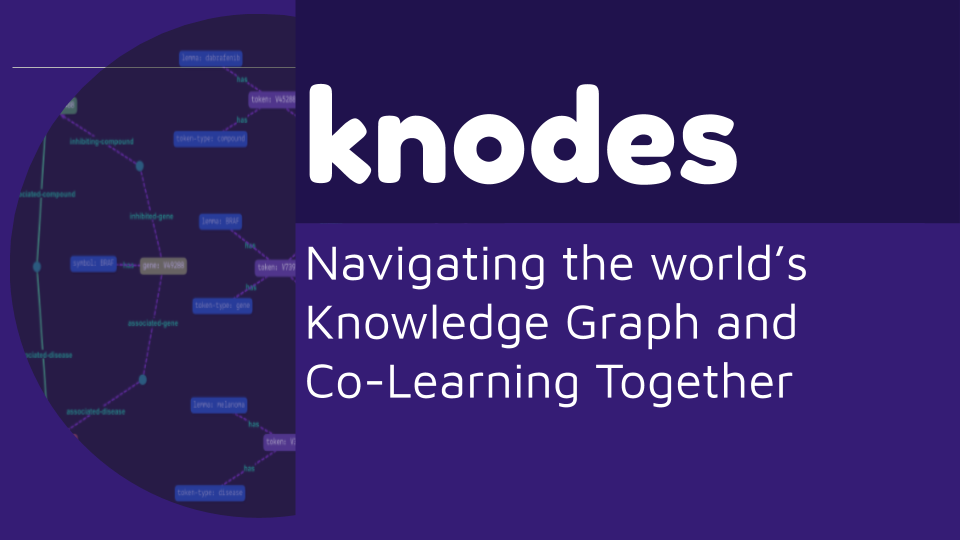
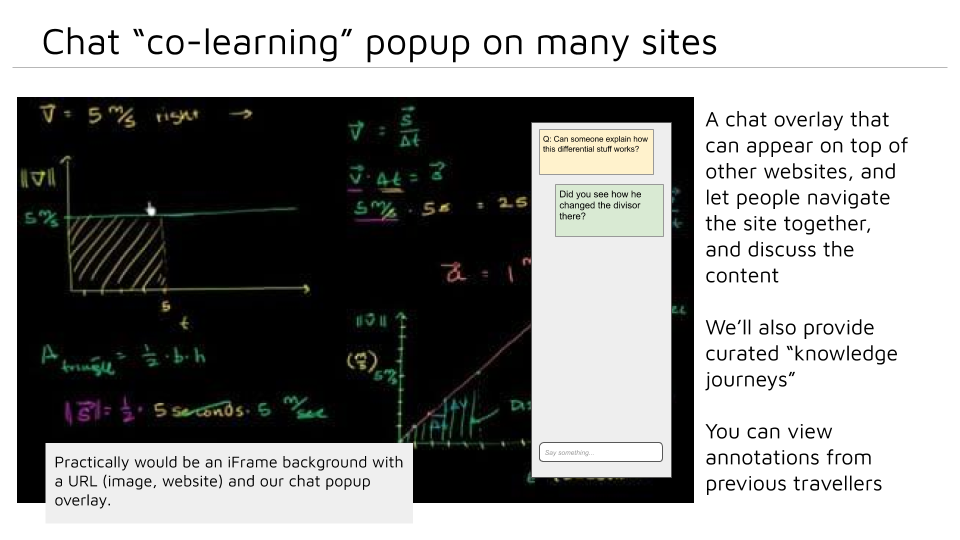
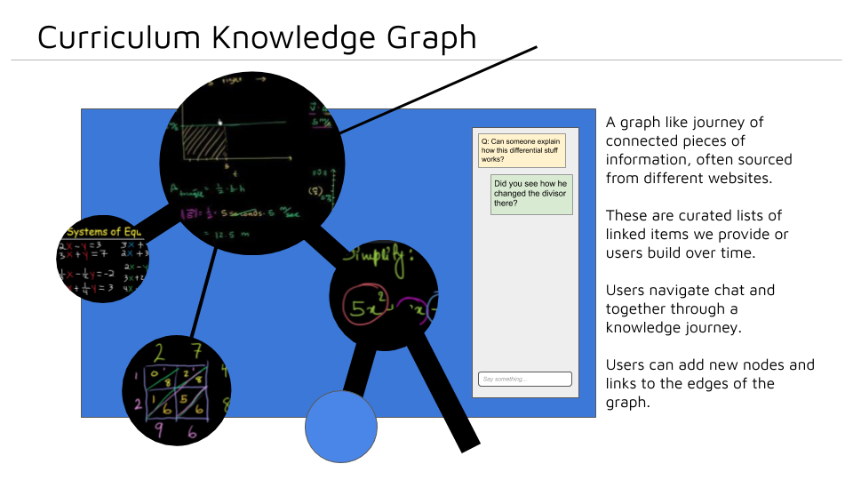

# knodes

Co-learning - learning together!

There's a huge amount of information on the web, but it's a very loneyly experience navigating through it.

This project aims to let people learn together, by providing journeys through the "web" of interesting knowledge that is out there, and a friendly chat interface to discuss what people are seeing.

We'll show the links between items so that people can choose to discover what's interesting to them.

Practically the service will use a graph database to curate knodes of information.
These can be URIs, images, YouTube videos or even text.

Users will visit our site and can start one of these curated journeys, or join others halfway.

As they chat they can "co-learn" together, making learning fun and making friends along the way!

More productive than Facebook! More fun than a MOOC!

Join us :D

