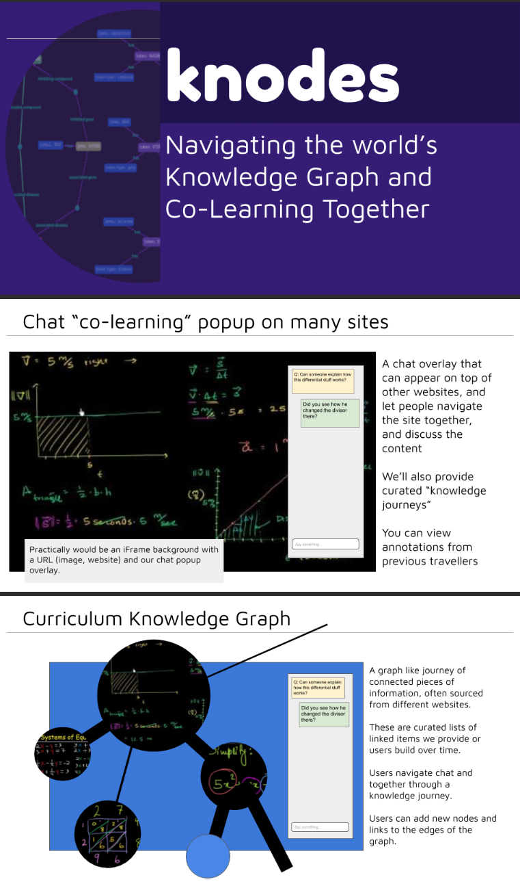

# Hey! Looking for teammates!

We're building a Co-Learning knowledge platform
Now that so many people are stuck at home, 
a) it's lonely
b) you might waste your time on Facebook

KNODES is a place to learn new things - together! 
A chat based website where you can navigate the knowledge out there on the web and learn things together.

- Meet new people and chat about meaninful stuff!
- Don't waste your time - learn new things!

# Tech Stack

- backend: python / flask
- frontend : JS/react/redux
- NLP: spacy
- ML: sklearn
- sockets chat front and back
- graph DB: neo4J

GitHub repo is here:
https://github.com/dcsan/knodes

Join us on channel #proj-knowdes

Looking for:
- designer!
- front and backend devs
- curriculum designer

Project lead: 'DC'
experienced hackathon dev https://devpost.com/dcsan
and tech founder

